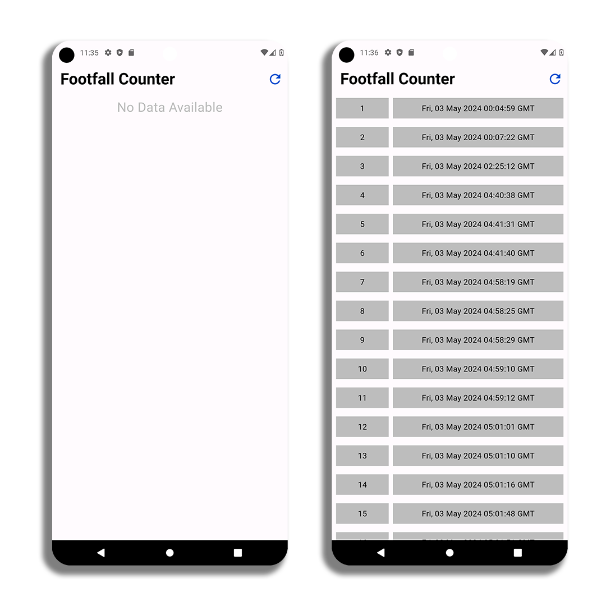

# Footfall Counter

## Overview

The Mall Footfall Counter is an IoT-based solution designed to accurately track the number of people entering a mall or a specific area within the mall. It utilizes sensors and cloud-based analytics to provide real-time and historical data on foot traffic, enabling mall management to make informed decisions regarding staffing, security, and marketing strategies.

## Features

- **Accurate Footfall Tracking**: Utilizes advanced sensors to accurately count the number of people entering and exiting the monitored area.
- **Real-time Data**: Provides real-time insights into foot traffic patterns, allowing mall management to respond promptly to changes in visitor flow.
- **Cloud-based Analytics**: Data is securely stored and analyzed in the cloud, offering comprehensive reports and visualizations accessible from anywhere.
- **Customizable Alerts**: Set up alerts for unusual spikes or dips in foot traffic, enabling proactive management actions.
- **Historical Data Analysis**: Access historical footfall data to identify trends, peak hours, and seasonal variations.

## Components

- **Sensor Nodes**: Installed at entry and exit points, these nodes capture data on people passing through.
- **Gateway Device**: Collects data from sensor nodes and transmits it to the cloud for analysis.
- **Cloud Analytics Platform**: Stores and processes footfall data, providing actionable insights and visualizations.
- **User Interface**: Web-based dashboard or mobile app for viewing real-time and historical footfall data.

## Installation

1. **Deploy Sensor Nodes**: Install sensor nodes at designated entry and exit points throughout the mall.
2. **Connect Gateway Device**: Connect the gateway device to the sensor nodes and ensure it has access to the internet.
3. **Configure Cloud Platform**: Set up the cloud analytics platform and configure it to receive data from the gateway device.
4. **Access User Interface**: Access the web-based dashboard or mobile app to view real-time and historical footfall data.

## Usage

1. **Monitor Foot Traffic**: Use the dashboard or app to monitor real-time footfall data and track visitor trends.
2. **Analyze Data**: Analyze historical footfall data to identify patterns, peak hours, and areas of high traffic.
3. **Optimize Operations**: Use insights from the footfall data to optimize staffing, security, and marketing strategies.
4. **Set Alerts**: Set up alerts to be notified of significant changes in foot traffic, enabling proactive management actions.

## Android App

The app offers seamless integration with existing systems and provides detailed analytics to give users a comprehensive understanding of customer traffic. With real-time data and insightful reports, it enables effective monitoring of visitor patterns, optimization of space usage, and data-driven decision-making to enhance overall operations and customer experience.

## Contributors

- Manas Pratim Das (https://github.com/2manas8)
- Md Haider Imam (https://github.com/haiderimam07)
- Sourabh (https://github.com/sourabhm1606)
